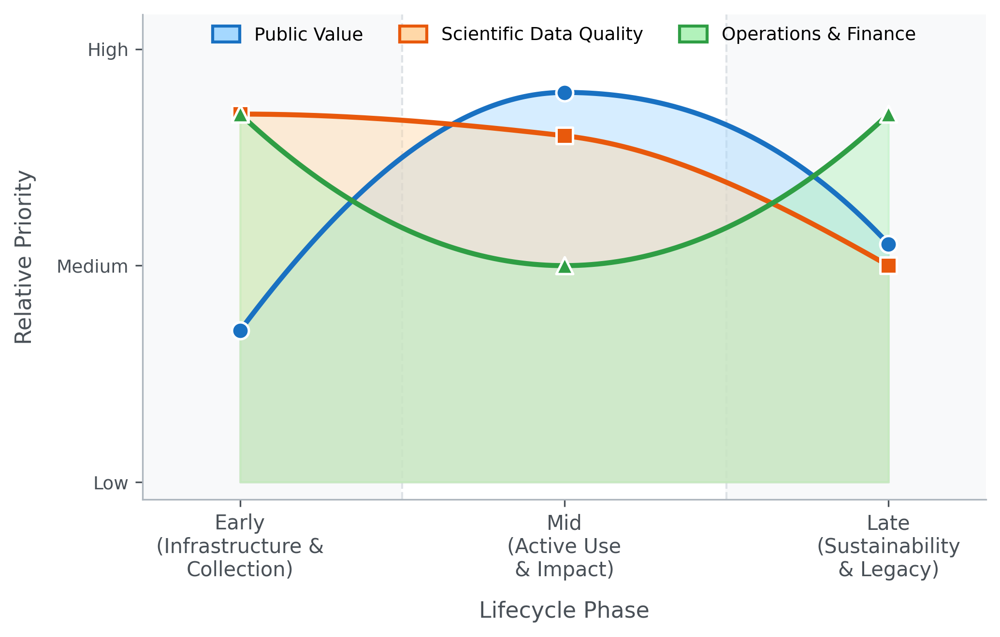

---
title: 'Metrics across the lifecycle: a framework for evaluating NIH biomedical data ecosystems'
keywords:
- markdown
- publishing
- manubot
lang: en-US
date-meta: '2026-03-17'
author-meta:
- Ethan M. Lange
- Vikram Adithya Ganesh
- Faisal Alquaddoomi
- David Mayer
- Adriana Ivich
- Vince Rubinetti
- Casey Greene
- Sean Davis
header-includes: |
  <!--
  Manubot generated metadata rendered from header-includes-template.html.
  Suggest improvements at https://github.com/manubot/manubot/blob/main/manubot/process/header-includes-template.html
  -->
  <meta name="dc.format" content="text/html" />
  <meta property="og:type" content="article" />
  <meta name="dc.title" content="Metrics across the lifecycle: a framework for evaluating NIH biomedical data ecosystems" />
  <meta name="citation_title" content="Metrics across the lifecycle: a framework for evaluating NIH biomedical data ecosystems" />
  <meta property="og:title" content="Metrics across the lifecycle: a framework for evaluating NIH biomedical data ecosystems" />
  <meta property="twitter:title" content="Metrics across the lifecycle: a framework for evaluating NIH biomedical data ecosystems" />
  <meta name="dc.date" content="2026-03-17" />
  <meta name="citation_publication_date" content="2026-03-17" />
  <meta property="article:published_time" content="2026-03-17" />
  <meta name="dc.modified" content="2026-03-17T23:15:11+00:00" />
  <meta property="article:modified_time" content="2026-03-17T23:15:11+00:00" />
  <meta name="dc.language" content="en-US" />
  <meta name="citation_language" content="en-US" />
  <meta name="dc.relation.ispartof" content="Manubot" />
  <meta name="dc.publisher" content="Manubot" />
  <meta name="citation_journal_title" content="Manubot" />
  <meta name="citation_technical_report_institution" content="Manubot" />
  <meta name="citation_author" content="Ethan M. Lange" />
  <meta name="citation_author_institution" content="Department of Biomedical Informatics, University of Colorado Anschutz Medical Campus" />
  <meta name="citation_author_orcid" content="0000-0001-7075-4287" />
  <meta name="citation_author" content="Vikram Adithya Ganesh" />
  <meta name="citation_author_institution" content="Department of Biomedical Informatics, University of Colorado Anschutz Medical Campus" />
  <meta name="citation_author_orcid" content="0009-0009-2056-2696" />
  <meta name="citation_author" content="Faisal Alquaddoomi" />
  <meta name="citation_author_institution" content="Department of Biomedical Informatics, University of Colorado Anschutz Medical Campus" />
  <meta name="citation_author_orcid" content="XXXX-XXXX-XXXX-XXXX" />
  <meta name="citation_author" content="David Mayer" />
  <meta name="citation_author_institution" content="Department of Biomedical Informatics, University of Colorado Anschutz Medical Campus" />
  <meta name="citation_author_orcid" content="XXXX-XXXX-XXXX-XXXX" />
  <meta name="citation_author" content="Adriana Ivich" />
  <meta name="citation_author_institution" content="Department of Biomedical Informatics, University of Colorado Anschutz Medical Campus" />
  <meta name="citation_author_orcid" content="XXXX-XXXX-XXXX-XXXX" />
  <meta name="citation_author" content="Vince Rubinetti" />
  <meta name="citation_author_institution" content="Department of Biomedical Informatics, University of Colorado Anschutz Medical Campus" />
  <meta name="citation_author_orcid" content="XXXX-XXXX-XXXX-XXXX" />
  <meta name="citation_author" content="Casey Greene" />
  <meta name="citation_author_institution" content="Department of Biomedical Informatics, University of Colorado Anschutz Medical Campus" />
  <meta name="citation_author_orcid" content="0000-0001-8713-9213" />
  <meta name="citation_author" content="Sean Davis" />
  <meta name="citation_author_institution" content="Department of Biomedical Informatics, University of Colorado Anschutz Medical Campus" />
  <meta name="citation_author_orcid" content="0000-0002-8991-6458" />
  <link rel="canonical" href="https://seandavi.github.io/2026-cfde-metrics-manuscript/" />
  <meta property="og:url" content="https://seandavi.github.io/2026-cfde-metrics-manuscript/" />
  <meta property="twitter:url" content="https://seandavi.github.io/2026-cfde-metrics-manuscript/" />
  <meta name="citation_fulltext_html_url" content="https://seandavi.github.io/2026-cfde-metrics-manuscript/" />
  <meta name="citation_pdf_url" content="https://seandavi.github.io/2026-cfde-metrics-manuscript/manuscript.pdf" />
  <link rel="alternate" type="application/pdf" href="https://seandavi.github.io/2026-cfde-metrics-manuscript/manuscript.pdf" />
  <link rel="alternate" type="text/html" href="https://seandavi.github.io/2026-cfde-metrics-manuscript/v/23cc13471b58f0c3db3478ab523d073f902340eb/" />
  <meta name="manubot_html_url_versioned" content="https://seandavi.github.io/2026-cfde-metrics-manuscript/v/23cc13471b58f0c3db3478ab523d073f902340eb/" />
  <meta name="manubot_pdf_url_versioned" content="https://seandavi.github.io/2026-cfde-metrics-manuscript/v/23cc13471b58f0c3db3478ab523d073f902340eb/manuscript.pdf" />
  <meta property="og:type" content="article" />
  <meta property="twitter:card" content="summary_large_image" />
  <link rel="icon" type="image/png" sizes="192x192" href="https://manubot.org/favicon-192x192.png" />
  <link rel="mask-icon" href="https://manubot.org/safari-pinned-tab.svg" color="#ad1457" />
  <meta name="theme-color" content="#ad1457" />
  <!-- end Manubot generated metadata -->
bibliography:
- content/manual-references.json
manubot-output-bibliography: output/references.json
manubot-output-citekeys: output/citations.tsv
manubot-requests-cache-path: ci/cache/requests-cache
manubot-clear-requests-cache: false
...

<small><em>
This manuscript
([permalink](https://seandavi.github.io/2026-cfde-metrics-manuscript/v/23cc13471b58f0c3db3478ab523d073f902340eb/))
was automatically generated
from [seandavi/2026-cfde-metrics-manuscript@23cc134](https://github.com/seandavi/2026-cfde-metrics-manuscript/tree/23cc13471b58f0c3db3478ab523d073f902340eb)
on March 17, 2026.
</em></small>

## Authors

+ **Ethan M. Lange**
   
    {.inline_icon width=16 height=16}
    [0000-0001-7075-4287](https://orcid.org/0000-0001-7075-4287)
     
  <small>
     Department of Biomedical Informatics, University of Colorado Anschutz Medical Campus
     · Funded by Grant U54OD036472
  </small>

+ **Vikram Adithya Ganesh**
   
    {.inline_icon width=16 height=16}
    [0009-0009-2056-2696](https://orcid.org/0009-0009-2056-2696)
    · {.inline_icon width=16 height=16}
    [techvik](https://github.com/techvik)
     
  <small>
     Department of Biomedical Informatics, University of Colorado Anschutz Medical Campus
     · Funded by Grant U54OD036472
  </small>

+ **Faisal Alquaddoomi**
   
    {.inline_icon width=16 height=16}
    [XXXX-XXXX-XXXX-XXXX](https://orcid.org/XXXX-XXXX-XXXX-XXXX)
    · {.inline_icon width=16 height=16}
    [falquaddoomi](https://github.com/falquaddoomi)
     
  <small>
     Department of Biomedical Informatics, University of Colorado Anschutz Medical Campus
     · Funded by Grant U54OD036472
  </small>

+ **David Mayer**
   
    {.inline_icon width=16 height=16}
    [XXXX-XXXX-XXXX-XXXX](https://orcid.org/XXXX-XXXX-XXXX-XXXX)
    · {.inline_icon width=16 height=16}
    [the-mayer](https://github.com/the-mayer)
     
  <small>
     Department of Biomedical Informatics, University of Colorado Anschutz Medical Campus
     · Funded by Grant U54OD036472
  </small>

+ **Adriana Ivich**
   
    {.inline_icon width=16 height=16}
    [XXXX-XXXX-XXXX-XXXX](https://orcid.org/XXXX-XXXX-XXXX-XXXX)
    · {.inline_icon width=16 height=16}
    [ivichadriana](https://github.com/ivichadriana)
     
  <small>
     Department of Biomedical Informatics, University of Colorado Anschutz Medical Campus
     · Funded by Grant U54OD036472
  </small>

+ **Vince Rubinetti**
   
    {.inline_icon width=16 height=16}
    [XXXX-XXXX-XXXX-XXXX](https://orcid.org/XXXX-XXXX-XXXX-XXXX)
    · {.inline_icon width=16 height=16}
    [vincerubinetti](https://github.com/vincerubinetti)
     
  <small>
     Department of Biomedical Informatics, University of Colorado Anschutz Medical Campus
     · Funded by Grant U54OD036472
  </small>

+ **Casey Greene**
  ^[✉](#correspondence)^ 
    {.inline_icon width=16 height=16}
    [0000-0001-8713-9213](https://orcid.org/0000-0001-8713-9213)
    · {.inline_icon width=16 height=16}
    [cgreene](https://github.com/cgreene)
     
  <small>
     Department of Biomedical Informatics, University of Colorado Anschutz Medical Campus
     · Funded by Grant U54OD036472
  </small>

+ **Sean Davis**
  ^[✉](#correspondence)^ 
    {.inline_icon width=16 height=16}
    [0000-0002-8991-6458](https://orcid.org/0000-0002-8991-6458)
    · {.inline_icon width=16 height=16}
    [seandavis](https://github.com/seandavis)
     
  <small>
     Department of Biomedical Informatics, University of Colorado Anschutz Medical Campus
     · Funded by Grant U54OD036472
  </small>

::: {#correspondence}
✉ — Correspondence possible via [GitHub Issues](https://github.com/seandavi/2026-cfde-metrics-manuscript/issues)
or email to
Casey Greene \<casey.s.greene@cuanschutz.edu\>, 
Sean Davis \<seandavi@gmail.com\>.

:::

## Bigger Picture {.page_break_before}

The U.S. government spends hundreds of millions of dollars every year creating and maintaining large collections of biomedical research data — from genome sequences of hundreds of thousands of people to detailed maps of every cell type in the human body.
The goal is to make these datasets openly available to scientists everywhere, accelerating discoveries that no single laboratory could achieve alone.

But how do we know whether this investment is paying off?
At present, each funded program tracks its own success metrics — if it tracks them at all — making it nearly impossible to compare programs or to learn from what works.
This is a significant missed opportunity.
In the business world, organizations use structured "performance frameworks" to evaluate products, adjust strategies, and decide where to invest next.
Publicly funded science deserves the same discipline.

In this paper, we describe three frameworks for evaluating biomedical data resources: one focused on how widely the data are used and scientifically cited, one on whether the data are well-documented and reusable by others, and one on whether the underlying infrastructure is reliable and financially sustainable.
We argue that different metrics matter more at different stages of a project's life — early on, data quality and infrastructure are paramount; later, scientific impact and long-term cost become critical.
Standardizing a common evaluation language across all NIH data programs would enable better decisions about where to invest, how to sustain valuable resources, and when to gracefully retire those that have served their purpose.

## Summary {.page_break_before}

The U.S. National Institutes of Health has invested billions of dollars in large-scale biomedical data resources, yet evaluation of these investments remains fragmented — each program tracks different metrics in different ways, preventing portfolio-level comparison and informed decision-making.
We propose a structured approach built on three complementary prioritization frameworks: *public value* (user engagement, citations, funded grants), *scientific data quality* (metadata completeness, FAIR compliance, data dictionaries), and *operations and finance* (infrastructure reliability, cost sustainability).
Critically, we argue that the relative importance of each framework shifts predictably across a data resource's lifecycle — from early infrastructure-building, through active use and impact, to long-term sustainability.
Drawing on data from the NIH Common Fund Data Ecosystem (CFDE), we identify gaps in current measurement practice and propose concrete metrics and tools — including FAIR maturity models, GitHub analytics, and cost-forecasting frameworks — to close them.

## Main text {.page_break_before}

Over the past decade, the U.S. National Institutes of Health (NIH) has made extraordinary investments in large-scale publicly available biomedical data resources.
These include the Cancer Research Data Commons [@doi:10.3389/fcell.2017.00083] (CRDC, NCI), the Cancer Genome Atlas (TCGA) [@pmid:24071849], the Trans-Omics for Precision Medicine program [@doi:10.1038/s41586-021-03205-y] (TOPMed, NHLBI), the All-of-Us Research Program [@doi:10.1056/NEJMsr1809937]. and .
NIH has complemented these with cloud computing environments — the Cancer Genomics Cloud [@doi:10.1158/0008-5472.CAN-17-0387], BioData Catalyst [@doi:10.5281/zenodo.3822858], and AnVIL [@doi:10.1016/j.xgen.2021.100085] — designed to make analysis at scale accessible to any researcher.
The collective ambition is to democratize access to reusable data and accelerate scientific discovery.

The Common Fund Data Ecosystem [@doi:10.1093/gigascience/giac105] (CFDE) takes a slightly different approach.
Building upon the data coordinating centers spanning 19 projects including GTEx [@doi:10.1038/ng.2653], the Human Microbiome Project [@doi:10.1038/nature11234; @doi:10.1038/nature11209], and HuBMAP [@pmid:31597973], the CFDE is a cross-cutting initiative that harmonizes metadata across these diverse datasets and provides a unified portal for discovery and access.
The CFDE's mission is to create a scalable, sustainable infrastructure that enables researchers to find and reuse data across the Common Fund portfolio, with the ultimate goal of accelerating scientific discovery and improving human health.
The ecosystem is organized into five specialized centers: the Data Resource Center (DRC), the Knowledge Center (KC), the Training Center (TC), the Cloud Workspace Implementation Center (CWIC), and the Integration and Coordination Center (ICC).
The ICC bears primary responsibility for leading annual program-wide metric collection and facilitating evaluation efforts in partnership with NIH program staff, ensuring a continuous improvement cycle and building the evidence base for future science investments.
The Council of Councils Working Group identified "facilitation of new scientific discovery" as the chief metric of CFDE success — specifically, the extent to which researchers can use Common Fund data to generate and validate novel hypotheses that were previously unattainable through isolated datasets [@https://dpcpsi.nih.gov/sites/default/files/Day2-1225PM-Final-Report-CFDE-CoC-WG-HorwitzWilder_.pdf].

The CFDE recently transitioned from its three-year pilot phase, which focused on establishing a coordination center and building the initial portal infrastructure [@https://commonfund.nih.gov/sites/default/files/OTA-23-004.pdf], to a full-scale implementation phase emphasizing outreach, skills development, and community-wide adoption [@https://commonfund.nih.gov/sites/default/files/OTA-24-004.pdf].
Evaluation frameworks must now adapt to capture this shift toward "use and reuse" as the primary drivers of impact.
Each center carries a distinct focus, as summarized in Table {@tbl:center-eval}.

| Center | Significance in the Ecosystem |
| :---- | :---- |
| Data Resource Center (DRC) | Primary entry point for researchers to query datasets |
| Knowledge Center (KC) | Cross-cutting biological insights through knowledge graphs |
| Training Center (TC) | Addresses the cultural shift required for cloud-based computing |
| Cloud Workspace (CWIC) | Computational power to analyze massive datasets in situ |
| Integration & Coordination (ICC) | Ensures disparate centers function as a unified ecosystem |

Table: Center-specific focus areas across the five CFDE centers. {#tbl:center-eval}

With five centers and 19 projects, the CFDE is a microcosm of the broader NIH data ecosystem, making it an ideal case study for developing and testing federated evaluation frameworks.

Evaluation across the CFDE has historically been somewhat fragmented: each program or projects tracks slightly different metrics in different ways, making portfolio-level evaluation challenging.
The business world has long solved analogous problems with structured prioritization frameworks that combine multiple performance metrics into coherent decision tools.
Public science needs equivalent rigor.
We contend that the "customer" is the research community, the "product" is reusable data and tools, and the measure of success is scientific discovery and improved human health.
We describe three complementary prioritization frameworks--*public value*, *scientific data quality*, *operations and finance*--and suggest that their importance and prioritization should vary over a project lifecycle.

Performance metrics have long been used in the business world to optimize decision-making, with established frameworks ranging from quantitative scoring functions such as RICE (Reach, Impact, Confidence, Effort) [@https://www.intercom.com/blog/rice-simple-prioritization-for-product-managers/] to qualitative prioritization methods such as MoSCoW ("must-have", "should-have", "could-have", "won't have") [@isbn:9780201624328].
Crucially, effective prioritization frameworks rely on metrics that are informative, feasible to collect, and economical to measure [@isbn:9780875846514; @isbn:9780273653349].
In publicly-funded research, the same principles apply: good metrics capture the use and impact of data resources, identify barriers to their success, and inform decisions about where to invest limited resources while being feasible to collect and not overly burdensome for project owners.
Furthermore, we show how centralization and automation can make the collection of these metrics more efficient, reducing the burden on individual projects and enabling real-time monitoring of portfolio performance.

### Three Frameworks, One Lifecycle

No single metric — and no single framework — can capture the full picture of a data resource's value or trajectory.
We organize our approach around three complementary prioritization frameworks: *public value*, *scientific data quality*, and *operations and finance*.
These frameworks overlap and sometimes conflict (more scientifically impactful datasets are often more expensive to create and maintain), and weighted composite scoring (*Multi-Criteria Decision Analysis*) can balance them when needed [@isbn:9780471465102; @isbn:9780792375067].
Our central argument is that these frameworks are not equally relevant at all times: metrics are a function of a resource's lifecycle phase.
In the **early term** — infrastructure-building and data collection — *scientific data quality* and *operations and finance* dominate.
In the **mid term** — active use within a funded period — all three matter, with *public value* taking on increasing importance.
In the **late, post-funding term** — sustainability and continued scientific relevance — *operations and finance* and *public value* become the primary lenses.
Embedding this lifecycle logic into evaluation design, rather than applying uniform metrics across all phases, is the key practical contribution of this paper.

{#fig:lifecycle_curves}

The *public value* framework captures the outputs and impacts of a data resource: user engagement, data downloads, funded grants, publications, and downstream scientific influence.
The *scientific data quality* framework measures reusability and long-term value, guided by the FAIR principles (Findable, Accessible, Interoperable, Reusable) [@doi:10.1038/sdata.2016.18; @doi:10.1038/sdata.2018.118] and encompassing the metadata, documentation, and standardization needed for data to be reliably reused.
The *operations and finance* framework covers the infrastructure and cost considerations — from server uptime and compute performance to the sustainability of funding beyond the initial grant period.
For each framework, we describe key metrics, their strengths and limitations, and highlight what current measurement approaches are missing.

### Public value

The *public value* framework encompasses user behavior and scientific impact.
Website engagement metrics — *page views*, *time on page*, *actions/triggers*, *priority link clicks*, and *new vs. returning users* — are easy to collect and track trends over time, but they provide limited insight into actual data use.
Combining *time on page* with *actions/triggers* offers a more informative measure of engagement.
A key limitation is that bots can skew counts, and VPN use in academic settings confounds new-versus-returning user tracking.
These metrics are typically collected via platforms such as Google Analytics [@https://marketingplatform.google.com/about/analytics/] or Matomo [@https://matomo.org/] (direct measurement) or estimated via Semrush [@https://semrush.com/] or Similarweb [@https://www.similarweb.com/]; note that some European jurisdictions restrict use of US-based analytics platforms.

More direct evidence of data engagement comes from *downloads* and *compute jobs*.
Downloads are a simple indicator of interest but cannot distinguish actual usage from passive acquisition, nor track data sharing among multiple users of the same file.
Cloud-hosted datasets address these limitations: compute jobs directly measure analysis activity, reduce sharing ambiguity, and can be monitored in near real-time (*trend downloads*, *trend compute jobs*).
Projects that include tool development — such as GlyGen [@doi:10.1093/glycob/cwz080] or Bridge2AI [@doi:10.1101/2024.03.11.584478] — also track *tool usage* (online) and *tool downloads*, with online usage being more accurately quantified.

User behavior metrics do not capture scientific impact.
The strongest proxies are publications and citations, accessible via PubMed [@https://pubmed.ncbi.nlm.nih.gov/], Scopus [@https://www.scopus.com/], Google Scholar [@https://scholar.google.com/], and Web of Science [@https://webofscience.com/].
*Number citations* is a direct measure of data influence; the initial GTEx paper [@doi:10.1038/ng.2653], for example, had accumulated 8,630 citations as of January 2026.
Citation impact can be weighted by the influence of each citing work — either by that paper's own citation count (*number secondary citations*) or by journal-level metrics (*citing impact score*).
A composite score weighted by secondary citations (*citations + secondary citations*) captures cumulative downstream impact that simple citation counts miss, and citation networks can also reveal new cross-disciplinary collaborations enabled by data sharing [@doi:10.1038/s42254-021-00368-x].
More sophisticated journal-level alternatives to simple impact factors include the Eigenfactor Score, which weights citations by the quality of the citing journal using a network-based algorithm, and the Article Influence Score, which measures the average influence per article — both better capture the prestige and subject-specific impact of data repositories than raw citation counts [@https://pmc.ncbi.nlm.nih.gov/articles/PMC4770502/].
Key limitations of citation-based metrics are that they lack context (a citation does not convey how central the dataset was to a study), and they lag by months to years relative to actual use.
Tracking the trend in citations over time (*trend citations*) helps identify whether a resource's scientific influence is growing, plateauing, or declining.

A fundamental challenge for citation-based evaluation is that data citation is not yet a universal standard in scientific publishing.
Studies estimate that fewer than 30% of articles performing secondary analysis provide a formal reference to the dataset used [@doi:10.1101/2023.09.12.557386].
This "citation gap" means that standard bibliometric approaches systematically underestimate data reuse.
Evaluators must therefore supplement citation tracking with multi-pronged strategies: searching for unique accession numbers (e.g., GEO accession numbers, NCBI BioProject IDs) in the full text of publications, mining Methods sections for mentions of specific repositories, and conducting case-study analyses of high-value datasets.
Bibliometric analysis of NeuroMorpho.Org, for example, demonstrated that sharing neural morphology data leads to a significant increase in citations for the original authors, with a reuse rate that remains constant for at least 16 years — effectively doubling peer-reviewed discoveries in the field [@doi:10.1101/2023.09.12.557386].
Closing this citation gap may ultimately require the CFDE to implement its own citation tracking web-services for more accurate and timely monitoring of data reuse across the portfolio.

Beyond usage and citation metrics, user-centered measures of *perceived value* offer complementary insight into how well a data platform serves its community.
Research integrating the Information System Success Model, the Technology Acceptance Model, and Consumer Perceived Value Theory identifies four entropy-weighted metrics that explain the majority of perceived value: *number of datasets* (breadth of coverage), *data timeliness* (currency for emergent challenges), *search comprehensiveness* (ability to return all relevant records across federated sources), and *system responsiveness* (loading times and API stability) [@doi:10.2196/63544].
These metrics can be assessed through structured surveys and complement the behavioral measures captured by web analytics.

The most profound long-term measure of public value is *practice change* — a fundamental shift in how science is conducted, moving from hypothesis-driven research to data-driven discovery and from evidence-based practice to practice-based evidence [@https://pmc.ncbi.nlm.nih.gov/articles/PMC4287083/].
Concrete indicators include the adoption rate of cloud-based workspaces versus local data downloads (a proxy for computational paradigm shift), cross-disciplinary co-authorship networks across Common Fund programs (a measure of new collaborative partnerships), and the geographic and institutional diversity of the user base, particularly the participation of early-stage investigators from under-resourced institutions.
These indicators capture whether a data ecosystem is achieving its ultimate goal of democratizing access and accelerating discovery.

### Scientific data quality

The *scientific data quality* framework addresses whether a resource's data can actually be found, understood, and reused by others.
Poor data quality and poor annotation are leading barriers to data reuse.
At the broadest level, metadata metrics document the study — its name, description, dates, funding, contributors, and website — and should be uniform across projects to enable portfolio-level comparisons.
At a finer grain, data-level metrics capture storage format, dataset size, data types (clinical, genomic, metabolomic, etc.), measurement platforms (e.g., Olink Explore HT for proteomics), biospecimen handling, and collection conditions (e.g., fasting status).
At the finest grain, dataset-level metrics include sample sizes, variable counts, demographic summaries, and QC statistics.

For evaluation purposes, summary metrics spanning all three levels are more tractable than cataloging every study-specific variable.
*Metadata completeness* counts the presence of required fields and can be assessed programmatically.
*Standardized metadata* assesses whether fields conform to community guidelines — a harder problem that often requires human review.
*Quality-control (QC) compliance* and *data uniqueness* are similarly difficult to automate and frequently require trained evaluators.
Two additional high-value metrics are the presence (*available data dictionary*) and quality (*quality data dictionary*) of a data dictionary that documents variable definitions, units, timing, and transformations; the former can be detected by script, the latter requires domain expertise.
The Standard Evaluation Framework for Large Health Care Data identifies 49 specific attributes grouped into three domains — the collection process, the data itself, and data use — that provide a comprehensive approach to assessing fitness for purpose [@doi:10.15585/mmwr.su7303a1].
Two attributes from this framework are particularly relevant for federated ecosystems like the CFDE: *representativeness*, the extent to which a dataset generalizes beyond its source population — critical for avoiding both Type 1 (false positive) and Type 2 (false negative) errors in scientific conclusions drawn from the data — and *linkability*, the extent to which data can be integrated with external sources, a paramount concern for an ecosystem whose mission is to enable queries across diverse programs.

A structured approach to assessing these qualities is provided by FAIR maturity models.
The evolution from first-generation ("Gen1") FAIR metrics — which relied on manual, human-assessed compliance — to second-generation ("Gen2") maturity indicators that are automated and machine-measurable [@doi:10.1038/sdata.2018.118] is essential for the CFDE, where the volume of metadata prevents manual auditing of every record.
The FAIRplus Dataset Maturity (FAIRplus-DSM) model [@https://fairplus.github.io/Data-Maturity/docs/Indicators/], developed for the life sciences, defines six levels ranging from Level 0 (no unique identifiers, unshared local storage) through Level 5 (provenance encoded in cross-community languages, enterprise-grade lifecycle management).
Levels 1–2 cover persistent identifiers and indexed metadata; Levels 3–4 require adherence to community reporting standards (e.g., MIAME) and semantic representation using linked data.
Ontology standardization at these higher maturity levels is particularly important for the CFDE's Knowledge Center, which relies on controlled terminologies to build integrated knowledge graphs that enable cross-omics queries.
The Research Data Alliance (RDA) further classifies FAIR indicators by priority — Essential (globally unique persistent identifiers, open access protocols), Important (machine-understandable knowledge representation), and Useful (automated data access by software agents) — providing a tiered roadmap for incremental improvement.
Automated tools such as the FAIR Evaluator can test digital resources against these indicators at scale using small web applications ("Compliance Tests") that programmatically assess each maturity indicator, making continuous *FAIR compliance* monitoring feasible for large portfolios [@doi:10.1038/sdata.2018.118].
The ICC is mandated by program funding announcements to leverage these automated assessments to monitor changes in the FAIRness of digital resources over time [@https://commonfund.nih.gov/sites/default/files/OTA-24-004.pdf].

### Operations and finance

The *operations and finance* framework addresses whether the infrastructure supporting a data resource is reliable, performant, and sustainable.
On the operations side, server-level metrics — *uptime*, *page load time*, *latency*, *server errors*, and *client errors* — can be captured via analytics platforms and log-file scripts.
Compute-level metrics (*download speed*, *cpu/gpu usage*, *memory usage*, *client queue times*, *job run times*) identify performance bottlenecks.
These metrics carry inherent variability due to time-of-day load, job size, and client-side network conditions, so monitoring trends rather than point-in-time values is most informative.

For projects built on open-source software — as many CFDE components are — GitHub repository analytics provide an additional operational window.
Development velocity (commit frequency, pull-request review latency, merge frequency) reflects team capacity and responsiveness to community contributions.
These dimensions can be combined into a composite "Repository Health Score" that provides a single summary indicator of project vitality.
Codebase health can be assessed by tracking stale pull requests, abandoned branches, and unresolved issues, which can signal accumulating technical debt, declining institutional support, or funding gaps.
Contributor dynamics — distinguishing core team commits from external community contributions — indicate whether training and outreach efforts are successfully broadening adoption.
For a more structured assessment of software components, the ELIXIR "Top 10 Metrics for Life Science Software Good Practices" provides a prioritized framework ranked by importance (impact on sustainability) and implementability (ease of generation) [@doi:10.12688/f1000research.9206.1].
These metrics — spanning version control, software discoverability, automated builds, test data availability, and documentation — offer a reproducible scorecard for evaluating the software that underpins data infrastructure.
A particularly relevant metric for federated ecosystems is "Minimal Reimplementation" — the preference for using established libraries over custom code — which reduces errors and technical debt across the portfolio.
The PIsCO (Performance Indicators framework for Collection of bioinformatics resource metrics) provides a server-side framework for automating the collection and visualization of these metrics, enabling integration of software health data directly into evaluation dashboards [@doi:10.12688/f1000research.9206.1].

On the finance side, sustainability has been identified by the Council of Councils as the "critical issue" for the CFDE, primarily because the programs that generate data are finite in duration [@https://dpcpsi.nih.gov/sites/default/files/Day2-1225PM-Final-Report-CFDE-CoC-WG-HorwitzWilder_.pdf].
*Funding cost* is the most accessible metric, but a full cost picture requires decomposing it into components: *sample collection*, *sample measurement*, *QC*, *data storage*, *data preservation* (beyond the grant period), *computing hardware*, *server maintenance*, *cloud-based computing*, and *personnel* costs.
The National Academies six-step framework for forecasting biomedical information resource costs identifies cost-driver categories — data content, metadata, labor, infrastructure, compliance, and governance — and notes that labor (curation and user support) consistently represents the largest single cost element [@https://www.ncbi.nlm.nih.gov/books/NBK562708/].
Costs vary significantly as data transitions through different states — from the primary research environment to the active repository to the long-term archive — and evaluation must be treated as an iterative process of planning, implementation, and reporting across these states.
Compliance costs — including HIPAA and FISMA requirements and regulatory governance for human-subjects data such as Kids First and GTEx — represent a distinct cost-driver category that is often underestimated in initial budgeting.
A critical but often overlooked question is the break-even point for data sharing: mathematical models suggest that the efficiency gains to the research community from reusing shared data do not always outweigh the curation costs borne by generators, highlighting the need for selective investment in high-value datasets.
Framing sustainability in terms of *cost per data reuse event* — dividing total curation and hosting costs by the number of documented reuse instances — provides a concrete, comparable KPI for portfolio-level evaluation.
More broadly, evaluating the return on investment (ROI) of a data ecosystem requires distinguishing between direct benefits (cost savings from economies of scale in data generation and curation) and extended benefits (scientific discoveries and improved clinical outcomes enabled by data reuse).
Cloud computing introduces additional complexity, as costs are provider-specific, usage-dependent, and subject to change unpredictably.
A summary of all metrics across frameworks is provided in Table 1.

Table 1\. Quick summary of included metrics and

| Metric | Difficulty | How Collected | Value | Lifecycle Phase | Notes |
| :---- | :---- | :---- | :---- | :---- | :---- |
| **User Behavior Framework** |  |  |  |  |  |
|  *page views*  |  Easy  |  Google Analytics  |  Low  | Mid |  A minimum indicator of interest.   |
|  *time on page*  |  Easy  |  Google Analytics  |  Low  | Mid |  A minimum indicator of interest.  |
|  *actions/triggers*  |  Easy  |  Google Analytics (Tag Manager)  |  Medium  | Mid |  A moderate indicator of interest.   |
|  *priority link clicks*  |  Easy  |  Google Analytics (Tag Manager)  |  Medium  | Mid |  A moderate indicator of interest.  |
|  *new vs returning users*  |  Medium  |  Google Analytics  |  Medium  | Mid |  A moderate indicator of continuing interest.  |
|  *downloads*  |  Easy  |  Google Analytics or Server-side logs  |  Medium-High  | Mid |  A strong indicator of interest. Downloading not equivalent to usage.  |
|  *compute jobs*  |  Easy  |  Compute scheduler logs or cloud environment logs  |  High  | Mid |  A direct indicator of interest.  |
|  *tool downloads*  |  Easy  |  Google Analytics or server-side logs  |  Medium-High  | Mid |  A strong indicator of interest.  |
|  *tool usage*  |  Easy  |  Google Analytics or API logs  |  High  | Mid |  A direct indicator of interest.  |
|  *trend downloads*  |  Medium  |  Google Analytics or server-side logs BI tools for visualization  |  Medium-High  | Mid–Late |  A strong indicator of change in interest over time.  |
|  *trend compute jobs*  |  Medium  |  Compute scheduler logs or cloud environment logs BI tools for visualization  |  High  | Mid–Late |  A direct indicator of change in interest over time.  |
|  *number grants*  |  Hard  |  NIH RePORTER Self-reporting  |  High  | Mid–Late |  Relevant grant data not publicly available.  |
|  *number presentations*  |  Hard  |  Self-reporting  |  Medium  | Mid–Late |  Data difficult to track and often not available in sufficient detail.  |
|  *number citations*  |  Easy  |  Google Scholar or CrossRef or other similar platforms  |  High  | Mid–Late |  A direct indicator of data value. Can miss downstream cumulative value.  |
|  *number secondary citations*  |  Medium  |    |  High  | Late |  An indirect measure of "downstream" value of initial publications.  |
|  *citations \+ secondary citations*  |  Medium  |    |  High  | Late |  A measure of cumulative impact over time of study data.  |
|  *trend citations*  |  Medium  |    |  High  | Late |  Measures change in impact of data over time. Subject to time lag in publications.  |
|  *data citation rate*  |  Hard  |  Full-text search for accession numbers, Methods section mining  |  High  | Mid–Late |  <30% of secondary analyses formally cite datasets. Multi-pronged tracking required.  |
|  *perceived value (user surveys)*  |  Medium  |  Structured surveys (ISSM/TAM framework)  |  High  | Mid–Late |  Entropy-weighted: dataset breadth, timeliness, search comprehensiveness, responsiveness.  |
|  *cloud adoption rate*  |  Medium  |  Cloud workspace logs vs. download logs  |  Medium-High  | Mid–Late |  Proxy for computational paradigm shift (cloud vs. local analysis).  |
|  *cross-disciplinary collaboration*  |  Hard  |  Co-authorship network analysis  |  High  | Late |  Measures new partnerships fostered across Common Fund programs.  |
|  *user diversity (geographic/institutional)*  |  Medium  |  User registration data, IAM logs  |  Medium-High  | Mid–Late |  Measures democratization of access, especially for under-resourced institutions.  |
|  |  |  |  |  |  |
| **Scientific Data Quality Framework** |  |  |  |  |  |
|  *metadata completeness*  |  Medium  |  Metadata validator, Schema validator  |  Medium-High  | Early |  Critical for drawing initial interest in study.  |
|  *standardized metadata*  |  Hard  |  Requires human-in-the-loop evaluation.  |  High  | Early |  Study-specific requirements.   |
|  *quality-control (QC) compliance*  |  Hard  |  Requires human-in-the-loop evaluation.  |  High  | Early |  Study-specific requirements.   |
|  *data uniqueness*  |  Hard  |  Requires human-in-the-loop evaluation.  |  Medium  | Early |  Subjective measure.   |
|  *FAIR compliance*  |  Hard  |  Requires human-in-the-loop evaluation.  |  High  | All |  Subjective measure.  |
|  *available data dictionary*  |  Medium  |  Checks on repository or documentation  |  Medium  | Early |  An essential component for a study to have. Does not guarantee quality.  |
|  *quality data dictionary*  |  Hard  |  Requires human-in-the-loop evaluation.  |  High  | Early |  A metric of quality of the data dictionary.   |
|  *representativeness*  |  Hard  |  Demographic and population metadata analysis  |  High  | Early |  Whether dataset generalizes beyond source population. Critical for avoiding false conclusions.  |
|  *linkability*  |  Hard  |  Schema and identifier compatibility assessment  |  High  | All |  Extent to which data integrates with external sources. Paramount for federated ecosystems.  |
|  |  |  |  |  |  |
| ***Operations and Finance*** **Framework** |  |  |  |  |  |
|  *uptime*  |  Easy  |  Uptime monitoring tool based on infrastructure/cloud used  |  Medium-Low  | Mid–Late |  Measure of server stability.  |
|  *page load time*  |  Easy  |  Google Analytics  |  Medium  | Mid–Late |  Measure of server performance.   |
|  *latency*  |  Easy  |  Google Analytics ( not real-time)  |  Medium  | Mid–Late |  Measure of server performance.  |
|  *server errors*  |  Easy  |  Server-side logs or Application Performance Monitoring (APM) tools  |  Medium  | Mid–Late |  Measure of server stability and performance.  |
|  *client errors*  |  Medium  |  Application logs or Application Performance Monitoring (APM) tools  |  Low  | Mid–Late |  Measure of errors on client end. Possible not addressable.  |
|  *download speed*  |  Easy  |  Server-side logs or Application Performance Monitoring (APM) tools  |  Low-Medium  | Mid–Late |  Download times can be function of client connection speeds.  |
|  *cpu/gpu usage*  |  Easy  |  Cloud/infrastructure logs or dashboards  |  High  | Mid–Late |  Important to evaluate performance and additional needs.  |
|  *memory usage*  |  Easy  |  Cloud/infrastructure logs or dashboards  |  High  | Mid–Late |  Important to evaluate performance and additional needs.  |
|  *number of users*  |  Easy  |  Google Analytics or IAM logs for granular details (if available)  |  Medium  | Mid–Late |  Indirect measure of computational load/burden.  |
|  *client queue times*  |  Easy  |  Cloud/infrastructure logs or dashboards  |  Medium-High  | Mid–Late |  Long queue times can result in less usage.  |
|  *job run times*  |  Easy  |  Cloud/infrastructure compute logs or dashboards  |  Medium  | Mid–Late |  Excessive long job run times can result in less usage.  |
|  *software good practices score*  |  Medium  |  ELIXIR Top 10 framework; automated collection via PIsCO  |  High  | All |  Covers version control, discoverability, automated builds, test data, documentation.  |
|  *funding cost*  |  Easy  |    |  High  | All |  Total cost of study. Critical element in evaluating study feasibility and sustainability.  |
|  *sample collection costs*  |  Medium  |    |  Medium  | Early |  Cost typically associated with early study period. Cost does not impact sustainability.  |
|  *sample measurement costs*  |  Medium  |    |  Medium  | Early |  Cost typically associated with early study period. Cost does not impact sustainability.  |
|  *QC costs*  |  Medium  |    |  Medium  | Early |  Cost typically associated with early study period. Cost does not impact sustainability.  |
|  *data storage costs*  |  Hard  |    |  High  | All |  Costs and requirements can fluctuate over study.  |
|  *data preservation costs*  |  Hard  |    |  High  | Late |  Costs and requirements can fluctuate over study. Difficult to assess years in advance.  |
|  *computing hardware costs*  |  Medium  |    |  Medium  | Early |  Costs often associated with initial study period, but replacement costs are possible.  |
|  *server maintenance costs*  |  Hard  |    |  High  | Mid–Late |  Costs can fluctuate. Major source of cost in sustainability period.   |
|  *cloud-based computing costs*  |  Hard  |  Cloud Cost Explorer tools or  |  High  | Mid–Late |  Costs are highly variable and subject to constant change (for both host and clients). Especially difficult to assess years in advance.  |
|  *personnel costs*  |  Medium  |    |  High  | All |  Can be measured in money or time. Requires committed time with relevant expertise.  |

## Some implementation progress and challenges

TBD

* Collection approach
* Metrics collected and how
* Dashboard implementation
* Challenges: data collection, data quality (e.g., bots, VPNs), data sharing (e.g., citation gap), sustainability (e.g., cost variability, break-even point for sharing), project privacy concerns (e.g., public dashboards), and more.

## Synthesis and Recommendations

The three frameworks described here — *public value*, *scientific data quality*, and *operations & finance* — are complementary rather than competing, and their relative importance shifts predictably across the data resource lifecycle.
Early-phase investments should prioritize the scientific data quality and operations frameworks: getting metadata right, establishing FAIR-compliant structures, and standing up reliable infrastructure are prerequisites for everything that follows.
Mid-phase evaluation should expand to all three frameworks, with particular attention to public value metrics as user communities engage with the data.
Late-phase and sustainability-focused evaluation should center on the public value and operations & finance frameworks, asking whether the resource continues to generate scientific impact and whether its costs can be justified in the absence of original funding.

No framework operates in isolation, and quantitative metrics alone cannot capture the full picture.
The NIH Common Fund emphasizes a "360-degree view" of program performance, using mixed-method designs to integrate quantitative metrics with the contextual understanding that only qualitative inquiry can provide [@https://commonfund.nih.gov/dataecosystem].
Mixed-method approaches — combining usage statistics and citation data with structured user interviews, focus groups, and surveys — are essential for understanding *why* certain resources succeed or fail, not just *what* is happening [@doi:10.1007/s10488-013-0528-y].
Qualitative metrics — including user satisfaction, perceived ease of use, and the "uniqueness" or "novelty" of the integrated data — complement quantitative indicators by revealing dimensions of value that usage counts cannot capture [@doi:10.2196/63544].
Two established designs are particularly suited to ecosystem evaluation: *sequential explanatory* designs, in which quantitative data (e.g., utilization rates) are collected first and then followed by qualitative interviews or focus groups to explain observed patterns, and *convergent* designs, in which both data types are collected simultaneously and compared at the interpretation stage to triangulate findings.
Logic models that explicitly connect inputs (funding, data, personnel) to activities (harmonization, training, curation), outputs (portals, trained users, tools), and outcomes (publications, funded grants, practice change) [@https://www.wkkf.org/resource-directory/resources/2004/01/logic-model-development-guide] provide the evaluative scaffolding needed to identify which elements of an ecosystem are working.
For the CFDE, these models should answer two critical evaluation questions: "To what extent are the elements of the logic model being implemented?" and "What are the critical paths through the model that lead to success?" [@pmid:30861395].
These models should be treated as living documents, revised as programs transition from pilot to full implementation.

A critical long-term challenge is closing the "know-do gap" — the distance between the information provided by metrics and actual decision-making.
Evidence from healthcare quality improvement suggests that the act of repeated, structured measurement itself drives behavioral change among data producers and managers — a phenomenon known as the Hawthorne effect [@https://pmc.ncbi.nlm.nih.gov/articles/PMC5616207/].
By requiring Common Fund programs to perform regular FAIRness assessments and report usage statistics, the NIH creates an environment of "sustained attention" that encourages long-term improvements in metadata practices and FAIR compliance [@https://grants.nih.gov/grants/guide/notice-files/NOT-OD-21-013.html].
NIH's 2023 Data Management and Sharing Policy creates a structural opportunity to establish pre-policy baselines for sharing and reuse, enabling rigorous before-and-after assessment of whether mandates translate into measurable ecosystem improvements.

Implementation of these evaluation frameworks can be accelerated through pilot "Driver Projects" — an approach pioneered by the Global Alliance for Genomics and Health (GA4GH) [@https://www.ga4gh.org/about-us/strategic-road-map/], in which selected projects test new standards and metrics in real-world settings and provide deep qualitative feedback on their utility.
For the CFDE, identifying Driver Projects across centers would generate practical evidence about which metrics are most informative and feasible before committing to portfolio-wide deployment.
Ultimately, the long-term measure of evaluation success is whether the ecosystem achieves practice change: a measurable shift toward data-driven discovery, broader cross-disciplinary collaboration, and more equitable access to computational resources.

Standardizing a core set of metrics across all NIH Common Fund programs — while allowing program-specific extensions — would enable the portfolio-level comparisons that are currently impossible.
The frameworks presented here, grounded in real evaluation data from the CFDE, offer a starting point for that standardization.

<!--
  OLD REFERENCES SECTION REMOVED - Manubot auto-generates references from citation keys.

  TODOs remaining:
  - Ref 2 (TCGA "Pan-Cancer Analysis Project" Cell 2014): verify correct paper and add DOI
  - Ref 10 (Volchenboum 2018 Kids First): incomplete citation, needs DOI
  - Ref 13 FAIRplus-DSM model: now cited via @https://fairplus.github.io/Data-Maturity/docs/Indicators/
  - Ref 16 (Dahal 2025, SAGE Open): needs DOI
  - Refs 29-32, 36, 37: existed in old reference list but were never cited in text
  - ISBN-based citations (refs 14, 15, 18, 19, 20) should be verified:
    - @isbn:9780875846514 (Kaplan & Norton, Balanced Scorecard)
    - @isbn:9780273653349 (Neely, Performance Prism)
    - @isbn:9780201624328 (Clegg & Barker, Case Method Fast-Track / MoSCoW)
    - @isbn:9780471465102 (Keeney & Raiffa, Decisions with Multiple Objectives)
    - @isbn:9780792375067 (Belton & Stewart, Multiple Criteria Decision Analysis)
-->

## References {.page_break_before}

<!-- Explicitly insert bibliography here -->

